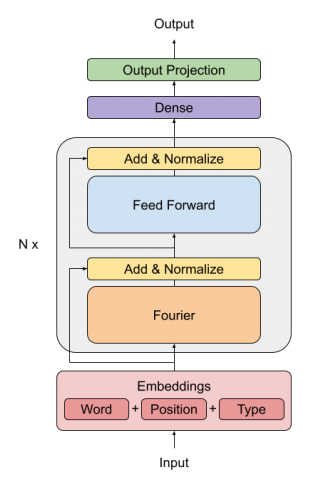

# fnet-google-pytorch
Pytorch implementation of [FNet: Mixing Tokens with Fourier Transforms by Google Research](https://arxiv.org/pdf/2105.03824.pdf)

This paper replace the Self-Attention block in the Transformer architecture with a Fourier Transform

</img>

## Usage
```python
 import torch
 from fnet import Fnet
 # N = number of layers, dhidden = input embedding size
 model = Fnet(N=2, dhidden=32)
 model = model.train(False)
 # batch_size=2, sequence_length=8, dhidden=32
 x = torch.randn((2, 8, 32))
 y = model(x)
 ```
 
 ## Citation
 ```bibtex
 @misc{leethorp2021fnet,
      title={FNet: Mixing Tokens with Fourier Transforms}, 
      author={James Lee-Thorp and Joshua Ainslie and Ilya Eckstein and Santiago Ontanon},
      year={2021},
      eprint={2105.03824},
      archivePrefix={arXiv},
      primaryClass={cs.CL}
}
```
